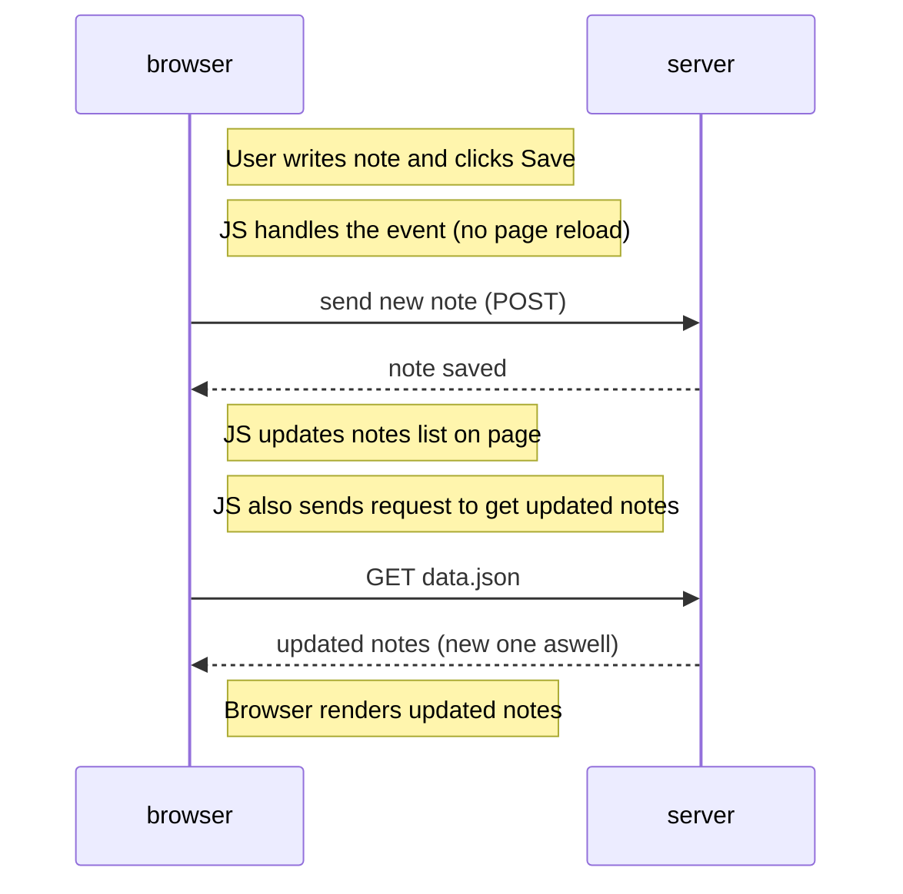

```mermaid
sequenceDiagram
    participant browser
    participant server

    Note right of browser: User writes note and clicks Save

    Note right of browser: JS handles the event (no page reload)

    browser->>server: send new note (POST)
    server-->>browser: note saved

    Note right of browser: JS updates notes list on page

    Note right of browser: JS also sends request to get updated notes

    browser->>server: GET data.json
    server-->>browser: updated notes (new one aswell)

    Note right of browser: Browser renders updated notes
```